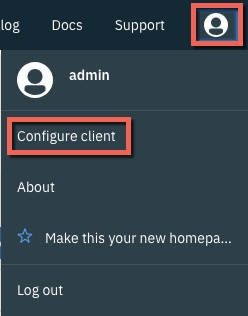
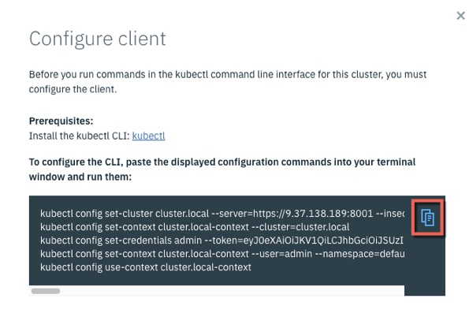

Lab - Install CLI and Tools
---

### Table of contents
[1. Install kubectl on the boot and master nodes](#kubectl)

[2. Configure kubectl to connect to your ICP Cluster](#connect)

[3. Install the ICP CLI](#bxcli)

[4. Install the Helm CLI](#helm)

## Overview
In this lab exercise, you install the Kubernetes CLI, the IBM Cloud Private CLI, and other useful tools.

### Install kubectl <a name="kubectl"></a> on the boot and master nodes

In some cases, it is possible that you may not be able to get a kube login context. It is a reasonable idea to install kubectl on the boot node and all master nodes.  In this environment, there is a boot and one master.
1. In a **terminal** session, connect to your `master` node as the **root** user, and run the following command to log into Docker.  Authenticate with the userid **admin** and password **passw0rd** :

  ```
  docker login icpboot.icp.local:8500
  ```
2.  From the same **terminal** session, run this command to pull the icp-inception image to the `master` node.
 
 ```
  docker pull icpboot.icp.local:8500/ibmcom/icp-inception:2.1.0.3-ee
  ```

3. Still in the same **terminal** session, run the following command to install the `kubectl` Kubernetes CLI:

  ```
  docker run -e LICENSE=accept --net=host -v /usr/local/bin:/data icpboot.icp.local:8500/ibmcom/icp-inception:2.1.0.3-ee cp /usr/local/bin/kubectl /data
  ```
  
4. Navigate to the `boot` node VM. In a terminal session, connect to the `boot` node as the **root** user. Run the following command to install the `kubectl` Kubernetes CLI:

  ```
  docker run -e LICENSE=accept --net=host -v /usr/local/bin:/data icpboot.icp.local:8500/ibmcom/icp-inception:2.1.0.3-ee cp /usr/local/bin/kubectl /data
  ``` 

The path `/usr/local/bin` may not be in the path of your system as in the case of this Skytap environment.  Add this to your path inside the .bash_profile and then source this profile profile:

```PATH=$PATH:/usr/local/bin ```

After saving the profile, source it from the command prompt:

```. .bash_profile```


### Configure kubectl to connect to your ICP Cluster <a name="connect"></a>
1. If you are not already logged in to the ICP Admin Console from a previous exercise, open a browser and navigate to `https://<icp_master_ip>:8443`. Log in by using `username: admin` and `password: admin`.

2. Click the **User** icon on the navigation bar, and then select **Configure Client** to display the commands that are used to configure a kubectl command line to connect to this ICP Cluster.

  

3. When the **Configure client** dialog displays, click the copy commands icon as shown below:

  

4. Return to the terminal window and paste in the commands. The output is similar to that shown below:

  ```
  # kubectl config set-cluster cluster.local --server=https://9.37.138.189:8001 --insecure-skip-tls-verify=true
  Cluster "cluster.local" set.

  # kubectl config set-context cluster.local-context --cluster=cluster.local
  Context "cluster.local-context" created.

  # kubectl config set-credentials admin --token=...
  User "admin" set.

  # kubectl config set-context cluster.local-context --user=admin --namespace=default
  Context "cluster.local-context" modified.

  # kubectl config use-context cluster.local-context
  Switched to context "cluster.local-context".
  ```

5. Issue the following command to get information about your ICP Cluster: `kubectl cluster-info`

  ```
  # kubectl cluster-info
  Kubernetes master is running at https://9.37.138.189:8001
  catalog-ui is running at https://9.37.138.189:8001/api/v1/namespaces/kube-system/services/catalog-ui:catalog-ui/proxy
  Heapster is running at https://9.37.138.189:8001/api/v1/namespaces/kube-system/services/heapster/proxy
  image-manager is running at https://9.37.138.189:8001/api/v1/namespaces/kube-system/services/image-manager:image-manager/proxy
  KubeDNS is running at https://9.37.138.189:8001/api/v1/namespaces/kube-system/services/kube-dns:dns/proxy
  metrics-server is running at https://9.37.138.189:8001/api/v1/namespaces/kube-system/services/https:metrics-server:/proxy
  platform-ui is running at https://9.37.138.189:8001/api/v1/namespaces/kube-system/services/platform-ui:platform-ui/proxy

  To further debug and diagnose cluster problems, use 'kubectl cluster-info dump'.
  ```

The **Kubernetes CLI** is now installed, and is used later in the workshop.

### Install the ICP CLI <a name="bxcli"></a>
1. In a **terminal** session on the `boot` node, run the following commands to download the **IBM Cloud CLI**.  Be sure to login as **root**.

  ```
  cd /tmp

  wget https://clis.ng.bluemix.net/download/bluemix-cli/0.6.1/linux64
  ```

2. Run the following commands to install the IBM Cloud CLI:

  ```
  mv ./linux64 bx.tar.gz

  tar -xvf bx.tar.gz

  cd Bluemix_CLI*

  ./install_bluemix_cli
  ```

3. Run the following command to download the **ICP CLI** from your ICP instance (insert the IP address of your master node):

  ```
  cd /tmp

  wget "https://<icp_master_ip>:8443/api/cli/icp-linux-amd64" --no-check-certificate
  ```

4. Run the following command to install the ICP CLI:

  ```
  bx plugin install ./icp-linux-amd64
  ```

5. Run the following command to login the ICP CLI in to your ICP Cluster:

  ```
  bx pr login -a https://<icp_master_ip>:8443 --skip-ssl-validation
  ```

6. Enter `username: admin` and `password: admin` when prompted, and select the `mycluster Account` as shown below.

  ```
  # bx pr login -a https://9.37.138.189:8443 --skip-ssl-validation
  API endpoint: https://9.37.138.189:8443
  Username> admin
  Password>
  Authenticating...
  OK

  Select an account:
  1. mycluster Account (id-mycluster-account)
  Enter a number> 1
  Targeted account mycluster Account (id-mycluster-account)

  Configuring helm and kubectl...
  Configuring kubectl: /root/.bluemix/plugins/icp/clusters/mycluster/kube-config
  Property "clusters.mycluster" unset.
  Property "users.mycluster-user" unset.
  Property "contexts.mycluster-context" unset.
  Cluster "mycluster" set.
  User "mycluster-user" set.
  Context "mycluster-context" created.
  Switched to context "mycluster-context".

  Cluster mycluster configured successfully.

  Configuring helm: /root/.helm
  Helm configured successfully

  OK
  ```

7. Run the following command to get information about your cluster:

  ```
  bx pr cluster-get mycluster
  ```

  The results of the command are shown below:
  ```
  # bx pr cluster-get mycluster
  Retrieving cluster mycluster...
  OK

  Name:			mycluster
  ID:			00000000000000000000000000000001
  State:			deployed
  Master URL:		https://kubernetes.default
  Masters:		1
  Workers:		3
  Proxies:		1
  ```

  The **IBM ICP CLI** is now installed, and is used later in the workshop.

### Install the Helm CLI <a name="helm"></a>
1. In a **terminal** session on the `boot` node, run the following commands to download and install the **Helm CLI**:

  ```
  cd /tmp

  docker run -e LICENSE=accept --net=host -v /usr/local/bin:/data ibmcom/icp-helm-api:1.0.0 cp /usr/src/app/public/cli/linux-amd64/helm /data
  ```

2. Run the following command to initialize the **Helm CLI**:
  ```
  helm init -c
  ```

  The results of the commands are shown below.

  ```
  # helm init -c
  Creating /root/.helm/repository
  Creating /root/.helm/repository/cache
  Creating /root/.helm/repository/local
  Creating /root/.helm/plugins
  Creating /root/.helm/starters
  Creating /root/.helm/cache/archive
  Creating /root/.helm/repository/repositories.yaml
  Adding stable repo with URL: https://kubernetes-charts.storage.googleapis.com
  Adding local repo with URL: http://127.0.0.1:8879/charts
  $HELM_HOME has been configured at /root/.helm.
  Not installing Tiller due to 'client-only' flag having been set
  Happy Helming!
  ```

3. Run the following command to list the configured Helm repositories:

  ```
  helm repo list
  ```

  The results of the commands are shown below

  ```
  # helm repo list
  NAME   	URL                                                                                                                      
  stable 	https://kubernetes-charts.storage.googleapis.com                                                                         
  local  	http://127.0.0.1:8879/charts                              
  ```

4. Run the following command to list the currently installed Helm releases:

  ```
  helm list --tls
  ```

  The **Helm CLI** is now installed, and is used later in the workshop.

#### End of Lab Review
  In this lab exercise, you installed and configured some of the command line tools that can be used with IBM Cloud Private:
  - Installed kubectl and configured it for use with your ICP Cluster
  - Installed the IBM Cloud CLI
  - Installed the Helm CLI

## End of Lab Exercise
