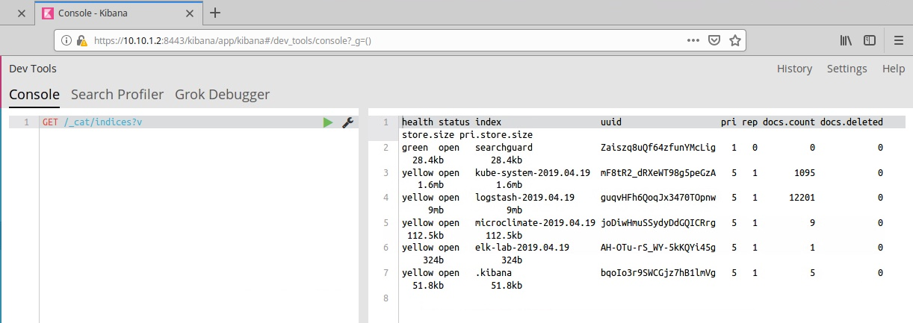
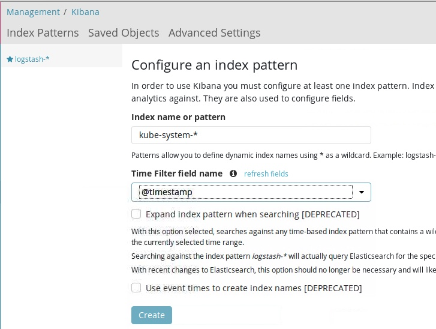
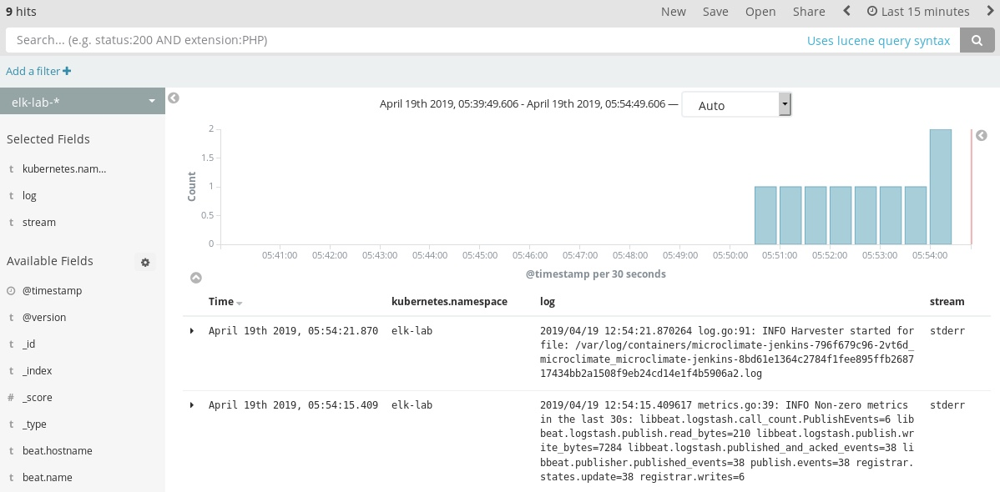

# Configuring ELK

This section is designed to describe the process of configuring the ICP ElasticStack that is bundled with ICP to meet multi tenancy requirements.

The OOTB configuration of ElasticStack that is deployed with ICP is makes some base assumptions that may be fine for some customers. However, it is an ElasticStack, so it so we can configure it.


The first thing we can do is modify the default index name. By default all application data is sent to a daily index with the prefix of "logstash-%Y.%m.%d". This index will collect quite a bit of data from all namespaces including tube-system and will grow quickly. Most of this data will not be relevant to the developers and will make it difficult to filter for specific events through the large amount of data. In addition all of the application data across namespaces is in the same index allowing developers to see data from other teams that may not be a member of.

To resolve this we need to make a change to the logstash configuration to create an index per namespace.

### Updating the logstash config

This is a simple 1 line change to the "logging-elk-elasticsearch-curator-config"

1. Execute the following command to edit the ConfigMap
 ```bash
 kubectl edit cm logging-elk-logstash-config -n kube-system
 ```

2. Replace line below and insert the following line (line 73)

  ```yaml
  #index => "logstash-%{+YYYY.MM.dd}"

  index => "%{kubernetes.namespace}-%{+YYYY.MM.dd}"
  ```

3. Save your edits and the deployment will be automatically update.


### Validate our changes

1. Login to ICP interface

2. Navigate to **Platform -> Logging** to bring up the Kibana interface

3. Once the Kibana interface opens, navigate to the **Dev Tools** from the menu bar on the left

4. In the console enter the following query and press the play icon ( green triangle)

   ```http
   GET /_cat/indices?v
   ```

5. You should see some new indices. We are looking for any new indices that match the namespace prefix we put in the logstash configmap.

*Note*:  Your system may have different indices depending on the ICP components installed.



6. You should see at a minimum a new index with the "kube-system-" prefix. That shows us that the modifications to the configmap are working.

7. Navigate to **Management** and click **Index Patterns --> Create New Index**

8. Create a new index for `kube-system` by entering `kube-system-*` as the **Index Pattern or Name** and selecting `@timestamp` from the **Time Filter field name** drop down as shown below. Click **Create**



9. Repeat the process to create another index for the `elk-lab` namespace using `elk-lab-*` and `@timestamp`

10. Navigate to **Discover** and change the index from `logstash-*` to `elk-lab-*`. You should now see some logs from the elk-lab pods and note that only the logs from the `elk-lab` namespace are being shown. Configure the view to show the `kubernetes.namespace`, `log` and `stream` fields.



11. Repeat the process to view the logs from the `kube-system` namespace

That concludes the changes to to the logstash configuration. We now need to update the curator to manage the data retention for the new indices.

# Updating the ELK Curator config

IBM Cloud Private comes pre-configured with a curator process to help manage the amount of data that is retained by the ELK stack. However this curator configuration is looking for the default "logstash-" prefix as the index name to clean-up. Since we split this single index into multiple smaller indexes we need to update the configuration.

The curator is a tool that is provided by ELK to manage the indices and it is managed by a YAML configuration file. In ICP this config file is presented to our curator pod as a configmap. So to change the behavior we need to update the configmap to use our new index names.

### Updating curator config

*Note: There are numerous options provided by the elasticsearch curator. A reference can be found [here](https://www.elastic.co/guide/en/elasticsearch/client/curator/current/actionfile.html).*

1. Edit the curator configmap (`logging-elk-elasticsearch-curator-config`)

   ```
   kubectl edit cm logging-elk-elasticsearch-curator-config -n kube-system
   ```

3. In this example we are going to modify the first action stanza of the config (starting on line 30 in my configmap)

   ```
       actions:
         1:
           action: delete_indices
           description: "Delete user log indices that are older than 1 days. Cron schedule: 30 23 * * *"
           options:
             timeout_override:
             continue_if_exception: True
             ignore_empty_list: True
             disable_action: False
           filters:
           - filtertype: pattern
             kind: prefix
             value: logstash-
           - filtertype: age
             source: name
             direction: older
             timestring: '%Y.%m.%d'
             unit: days
             unit_count: 1
   ```

   We want to modify the *kind* and *value* fields in this stanza to a regex to match our indices. Similar to the example below. You will want to add the prefix for your namespaces in the regex *value* field.

   ```
   actions:
         1:
           action: delete_indices
           description: "Delete user log indices that are older than 1 days. Cron schedule: 30 23 * * *"
           options:
             timeout_override:
             continue_if_exception: True
             ignore_empty_list: True
             disable_action: False
           filters:
           - filtertype: pattern
             kind: regex
             value: '^(logstash-|kube-system-|elk-lab-|microclimate-).*$'
           - filtertype: age
             source: name
             direction: older
             timestring: '%Y.%m.%d'
             unit: days
             unit_count: 1
   ```

*Note: We left the "logstash-" prefix in there since it will take 2 days for the old indices to clean-up. After the "logstash-" indices are deleted you can remove that prefix from the config.*

4. Save your setting and the changes will automatically be updated in the configmap.

5. Wait for the curator cronjob to trigger the curator process (it runs at 23:30 daily by default) and check the indices to determine if the old indices have been removed.

   You may also want to check the job logs to verify that the curator is removing the correct indices.

   ```
   kubectl get jobs -n kube-system
   kubectl logs job/logging-elk-elasticsearch-curator-<xxxxxxxxxx>
   ```

   Sample output:

   ```
    Curator launching @ Mon Jan 14 23:30:12 UTC 2019
    2019-01-14 23:30:12,647 INFO      Preparing Action ID: 1, "delete_indices"
    2019-01-14 23:30:12,680 INFO      Trying Action ID: 1, "delete_indices": Delete user log indices that are older than 1 days. Cron schedule: 30 23 * * *
    2019-01-14 23:30:12,800 INFO      Deleting selected indices: [u'istio-system-2019.01.10', u'istio-system-2019.01.11', u'istio-system-2019.01.12', u'istio-system-2019.01.13', u'kube-system-2019.01.13']
    2019-01-14 23:30:12,801 INFO      ---deleting index istio-system-2019.01.10
    2019-01-14 23:30:12,801 INFO      ---deleting index istio-system-2019.01.11
    2019-01-14 23:30:12,801 INFO      ---deleting index istio-system-2019.01.12
    2019-01-14 23:30:12,801 INFO      ---deleting index istio-system-2019.01.13
    2019-01-14 23:30:12,801 INFO      ---deleting index kube-system-2019.01.13
    2019-01-14 23:30:19,316 INFO      Action ID: 1, "delete_indices" completed.
    2019-01-14 23:30:19,316 INFO      Preparing Action ID: 2, "delete_indices"
    2019-01-14 23:30:19,338 INFO      Trying Action ID: 2, "delete_indices": Delete elastic system monitoring log indices that are older than 1 days. Cron schedule: 30 23 * * *
    2019-01-14 23:30:19,472 INFO      Skipping action "delete_indices" due to empty list: <class 'curator.exceptions.NoIndices'>
    2019-01-14 23:30:19,472 INFO      Action ID: 2, "delete_indices" completed.
    2019-01-14 23:30:19,472 INFO      Preparing Action ID: 3, "delete_indices"
    2019-01-14 23:30:19,504 INFO      Trying Action ID: 3, "delete_indices": Delete elastic watcher history indices that are older than 1 days. Cron schedule: 30 23 * * *
    2019-01-14 23:30:19,690 INFO      Skipping action "delete_indices" due to empty list: <class 'curator.exceptions.NoIndices'>
    2019-01-14 23:30:19,690 INFO      Action ID: 3, "delete_indices" completed.
    2019-01-14 23:30:19,690 INFO      Preparing Action ID: 4, "delete_indices"
    2019-01-14 23:30:19,713 INFO      Trying Action ID: 4, "delete_indices": Delete vulnerability advisor indices that are older than 90 days. Cron schedule: 30 23 * * *
    2019-01-14 23:30:19,823 INFO      Deleting selected indices: [u'vulnerabilityscan-2019.01.13', u'compliance-2019.01.13', u'secconfig1-2019.01.13']
    2019-01-14 23:30:19,823 INFO      ---deleting index vulnerabilityscan-2019.01.13
    2019-01-14 23:30:19,823 INFO      ---deleting index compliance-2019.01.13
    2019-01-14 23:30:19,823 INFO      ---deleting index secconfig1-2019.01.13
    2019-01-14 23:30:20,323 INFO      Action ID: 4, "delete_indices" completed.
    2019-01-14 23:30:20,326 INFO      Preparing Action ID: 5, "delete_indices"
    2019-01-14 23:30:20,349 INFO      Trying Action ID: 5, "delete_indices": Delete audit log indices that are older than 1 days. Cron schedule: 30 23 * * *
    2019-01-14 23:30:20,463 INFO      Skipping action "delete_indices" due to empty list: <class 'curator.exceptions.NoIndices'>
    2019-01-14 23:30:20,463 INFO      Action ID: 5, "delete_indices" completed.
    2019-01-14 23:30:20,463 INFO      Job completed.
    Curator finished @ Mon Jan 14 23:30:20 UTC 2019
   ```

### Conclusion

What we have done here is an example of how you could configure the curation process for multiple new indices. We basically used the default behavior to keep 1 day worth of data. However, you may want to have different retention policies for specific namespace and you may need to add a new action to the config to handle that specific index.

You may want to consider implementing a namespace naming convention for your namespaces so you can use a pattern for matching the index name in the curator config.

For example:

prod-<namespace> - A namespace with the "prod-" prefix might keep data for 2 weeks.

test-<namespace> - May only keep data for 1 day.

The curator is something that you will want to keep an eye on. If an index is created that does not match any of the patterns it will not be pruned and will continue to use system resources.
