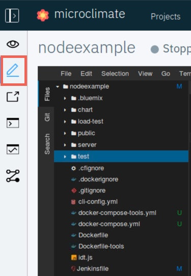
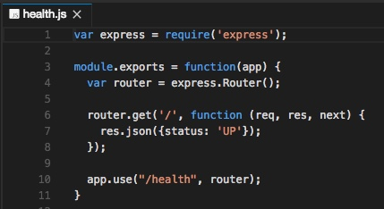
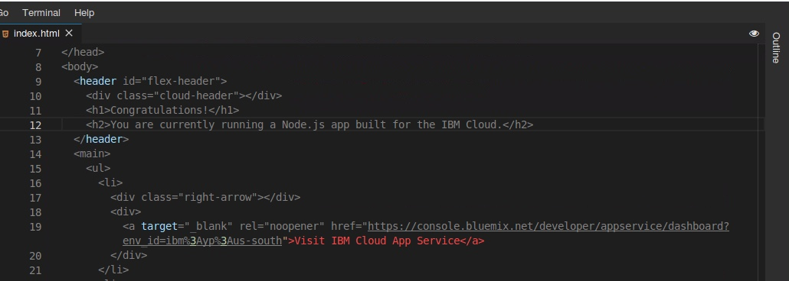
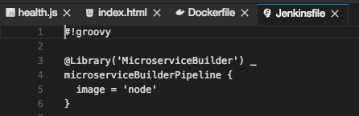
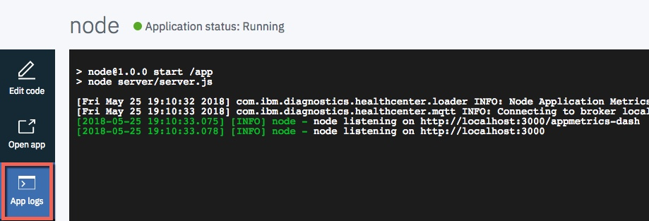
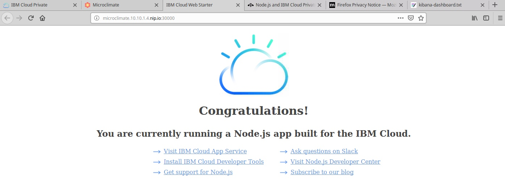
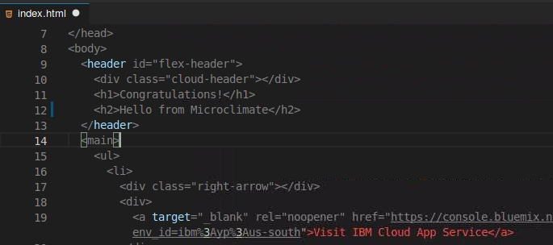
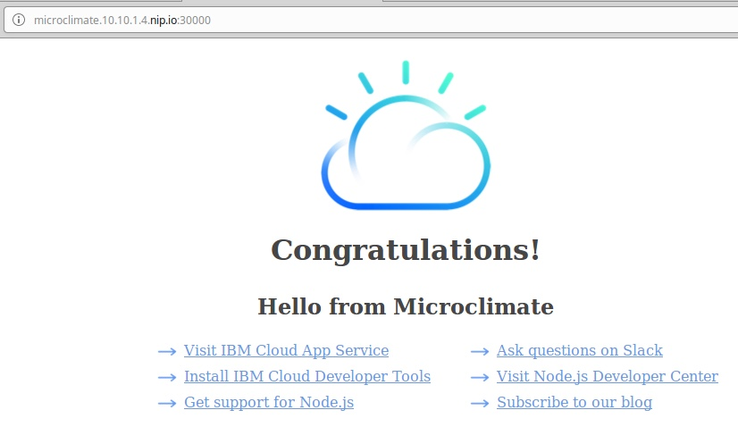
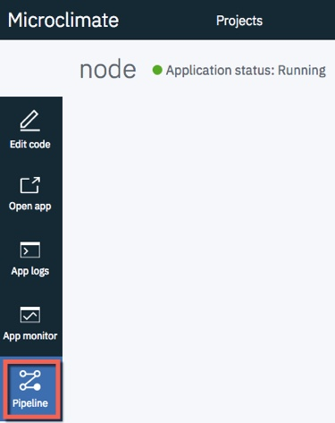
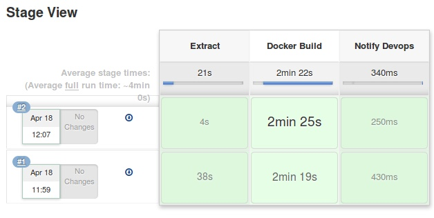

Lab - Microclimate
---

### Table of contents
[1. Configure ICP for Microclimate](#configure)

[2. Deploy the Microclimate Helm Chart](#deploychart)

[3. Import an example project in to Microclimate](#import)

[4. Create a Jenkins pipeline for the project](#jenkins)

## Overview
In this lab exercise, you install **microclimate** in to your ICP Cluster, develop applications from scratch, and import existing applications.

### Configure ICP for Microclimate <a name="configure"></a>
In this section, you configure the environment for Microclimate.

1. In the ICP Admin Console, click **Catalog** and locate the **ibm-microclimate** helm chart. Review the information page.

#### Create Docker secrets
1. In a **terminal** session connected to your `MASTER` node as the **root** user, run the following command to create some new namespaces:

    ```
    kubectl create namespace microclimate
    kubectl create namespace microclimate-pipeline-deployments
    ```
2. Run the following command to create a Docker registry secret in the microclimate namespace:

   ```
   kubectl create secret docker-registry microclimate-registry-secret \
     --docker-server=mycluster.icp:8500 \
     --docker-username=admin \
     --docker-password=passw0rd \
     --docker-email=null \
     -n microclimate
   ```

3. Run the following command to create a Docker registry secret in the microclimate-pipeline-deployments namespace:

   ```
   kubectl create secret docker-registry microclimate-pipeline-secret \
     --docker-server=mycluster.icp:8500 \
     --docker-username=admin \
     --docker-password=passw0rd \
     --docker-email=null \
     -n microclimate-pipeline-deployments
   ```

2. Run the following command to patch the service account:

    ```
    kubectl patch serviceaccount default --namespace microclimate-pipeline-deployments -p "{\"imagePullSecrets\": [{\"name\": \"microclimate-pipeline-secret\"}]}"
    ```

#### Create Helm secret

1. Run the following commands to login to ICP and initialize Helm:

    ```
    cd /root

    cloudctl login -a https://10.10.1.2:8443 --skip-ssl-validation
    ```

2. Run the following command to create the Helm secret that is required by microclimate:

    ```
    kubectl create secret generic microclimate-helm-secret \
    --from-file=cert.pem=.helm/cert.pem \
    --from-file=ca.pem=.helm/ca.pem \
    --from-file=key.pem=.helm/key.pem \
    -n microclimate
    ```


#### Create Persistant Volumes (PV) and Persistant Volume Claims (PVC)
Microclimate requires two PVCs to function: one to store workspace data, and another for Jenkins. The following steps walk you through the process of creating the PV and PVC.

**Note**: In this lab environment, there is a VM dedicated to the NFS Server, but it needs to be configured. You will configure it now.

1. Start by installing the nfs-client package on the worker nodes. In a **terminal** session connected to the `WORKER` node (as the `root` user) run the following commands to install the nfs-client.

    ```
    apt-get install -y nfs-common
    ```

2. Switch to the `NFS` node (as the `root` user), open a **terminal** session and run the following commands to install the nfs-server.

    ```
    apt-get install -y nfs-kernel-server
    ```

3. Issue the following command to create a directory to hold the NFS shared directories

    ```
    mkdir /storage
    chmod 777 /storage
    ```

4. Use vi to edit the `/etc/exports` file to expose the `/storage` directory. Add the following line to `/etc/exports` and save the file

    ```
    /storage           *(rw,sync,no_subtree_check,async,insecure,no_root_squash)

    ```

5. Issue the following commands to load the changes and restart nfs

    ```
    exportfs -ra
    service nfs-kernel-server restart
    ```

6. Now you are ready to create the PVs that this lab exercise will use. Run the following commands to create the directories that are mapped to the PV:

    ```
    cd /storage

    mkdir mc-workspace

    mkdir mc-jenkins

    chmod 777 mc*
    ```

7. In a **terminal** session that is connected to your `MASTER` node as the **root** user, copy the following PV definition in to a file named `mc-workspace-pv.yaml`, and verify the **server IP address** (10.10.1.6) is the correct one for your environment.

    ```
    apiVersion: v1
    kind: PersistentVolume
    metadata:
      name: microclimate-workspace
    spec:
      accessModes:
        - ReadWriteMany
      persistentVolumeReclaimPolicy: Retain
      capacity:
        storage: 8Gi
      nfs:
        path: /storage/mc-workspace
        server: 10.10.1.6
    ```

8. Copy the following PV definition in to a file named `mc-jenkins-pv.yaml`, and verify the **server IP address** (10.10.1.6) is the correct one for your environment:

    ```
    apiVersion: v1
    kind: PersistentVolume
    metadata:
      name: microclimate-jenkins
    spec:
      accessModes:
        - ReadWriteOnce
      persistentVolumeReclaimPolicy: Retain
      capacity:
        storage: 8Gi
      nfs:
        path: /storage/mc-jenkins
        server: 10.10.1.6
    ```

9. Copy the following PVC definition in to a a file named `mc-workspace-pvc.yaml`:

    ```
    kind: PersistentVolumeClaim
    apiVersion: v1
    metadata:
     name: mc-workspace-pvc
    spec:
     accessModes:
       - ReadWriteMany
     resources:
       requests:
         storage: 8Gi
    ```

10. Copy the following PVC definition in to a file named `mc-jenkins-pvc.yaml`:

    ```
    kind: PersistentVolumeClaim
    apiVersion: v1
    metadata:
     name: mc-jenkins-pvc
    spec:
     accessModes:
       - ReadWriteOnce
     resources:
       requests:
         storage: 8Gi
    ```

11. Create the Persistent Volumes, and Persistent Volume Claims by using the following commands:

   ```
   kubectl create -f ./mc-workspace-pv.yaml

   kubectl create -f ./mc-workspace-pvc.yaml -n microclimate

   kubectl create -f ./mc-jenkins-pv.yaml

   kubectl create -f ./mc-jenkins-pvc.yaml -n microclimate
   ```

12. Verify that the PVCs are successfully **Bound** to the PVs by running the following command:

`kubectl get pvc -n microclimate`

```
root@master:~# kubectl get pvc -n microclimate
NAME               STATUS   VOLUME                   CAPACITY   ACCESS MODES   STORAGECLASS   AGE
mc-jenkins-pvc     Bound    microclimate-jenkins     8Gi        RWO                           34s
mc-workspace-pvc   Bound    microclimate-workspace   8Gi        RWX                           90s
```

#### Create the Image Policy
Microclimate needs to pull images from dockerhub that aren't covered by the default Cluster Image Policy. Here you will create a new policy to allow the images to be pulled

1. Copy the following definition in to a file named `mc-policy.yaml`

    ```
    apiVersion: securityenforcement.admission.cloud.ibm.com/v1beta1
    kind: ClusterImagePolicy
    metadata:
      name: microclimate-cluster-image-policy
    spec:
      repositories:
      - name: <cluster_ca_domain>:8500/*
      - name: docker.io/maven:*
      - name: docker.io/jenkins/*
      - name: docker.io/docker:*
    ```
2. Create the Image Policy by using the following commands:

   ```
   kubectl create -f mc-policy.yaml
   ```

### Deploy the Microclimate Helm Chart <a name="deploychart"></a>
In this section, you deploy the Microclimate Helm Chart by using the IBM Admin console.

1. Click **Catalog** from the ICP Admin Console menu bar to navigate to the Catalog of Helm Charts, and search for the `ibm-microclimate` chart.

2. Click the chart, read the overview, and then click **Configure**.

3. Enter the following information (accept the defaults for all other values), and click **Install**:

  | Parameter       | Value |
  | ------------- |-------------|
  | Release name  | microclimate |
  | Target namespace  | microclimate |
  | I have read and agreed to the License Agreements | yes |
  | Microclimate Ingress Domain | 10.10.1.4.nip.io |

**NOTE: if 'microclimate' isn't shown in the Target namespace box, click Cancel and click the Catalog button on the ICP Admin Console menu bar and search for ibm-microclimate again - this seems to be a bug in the UI where the list isn't populated correctly the first time**

  In the **Microclimate** section:

  | Parameter       | Value |
  | ------------- |-------------|
  | Existing PersistentVolumeClaim Name | mc-workspace-pvc |
  | Dynamic Provisioning | no |


  In the **Jenkins** section:

  | Parameter       | Value |
  | ------------- |-------------|
  | Jenkins - Existing PersistentVolumeClaim Name | mc-jenkins-pvc |

5. You can monitor the status of your deployment from the CLI. Run the command, `kubectl get po -n microclimate`.

Note: It might take up to 5 minutes to get a **Running** status for all of the Microclimate pods.

```
# root@master:~# kubectl get po -n microclimate
NAME                                                    READY   STATUS    RESTARTS   AGE
microclimate-ibm-microclimate-67bf649679-jf4t9          1/1     Running   0          7m27s
microclimate-ibm-microclimate-atrium-5bc654794-9qsqr    1/1     Running   0          7m28s
microclimate-ibm-microclimate-devops-86b755bb4b-jzht9   1/1     Running   0          61s
microclimate-jenkins-796f679c96-2vt6d                   1/1     Running   0          7m28s
```

6. Once all the pods are running, you can open a browser tab and navigate to http://microclimate.10.10.1.4.nip.io.

7. Read and accept the Microclimate license agreement, and click **Accept**.

8. After the first log in to microclimate you may have to wait a few minutes for the rest of microclimate to start. Return to your terminal session and issue `kubectl get po -n microclimate` again and wait until the *editor*, *filewatcher* and *loadrunner* pods are running

```
root@master:~# kubectl get po -n microclimate
NAME                                                              READY   STATUS    RESTARTS   AGE
microclimate-ibm-microclimate-67bf649679-jf4t9                    1/1     Running   0          14m
microclimate-ibm-microclimate-admin-editor-77cdd55695-jkrnz       2/2     Running   0          5m41s
microclimate-ibm-microclimate-admin-filewatcher-57479d9fbcb9pbb   1/1     Running   0          5m41s
microclimate-ibm-microclimate-admin-loadrunner-54d98f87c6-gt5xm   1/1     Running   0          5m40s
microclimate-ibm-microclimate-atrium-5bc654794-9qsqr              1/1     Running   0          14m
microclimate-ibm-microclimate-devops-86b755bb4b-jzht9             1/1     Running   0          8m2s
microclimate-jenkins-796f679c96-2vt6d                             1/1     Running   0          14m
```


### Import and test an example project in to Microclimate <a name="import"></a>
In this section, you import an example NodeJS microservice project in to Microclimate.

1. Select Import Project.

2. Enter `https://github.com/davemulley/nodeexample` in the Git field, and click **Next**.

3. Enter the project name as `nodeexample`. Verify that **Authentication required is not selected**, and click **Finish Import and Validate**. You will be prompted to validate the project type. Click **Finish Validation**

4. Once the project is imported, the **Microclimate Dashboard** displays. Click **Files**, as shown below.

    

5. Using the File Viewer, open `/nodeexample/public` and `/nodeexample/server`, and review the source code for the sample application.

6. Open the `health` endpoint (`/nodeexample/server/routers/health.js`). Note that it simply replies with `status: UP` whenever invoked. Kubernetes uses this endpoint to determine whether the application is up and running, or not.

    

7. Open `/nodeexample/public/index.html`. Note that the page replies with a simple message (**scroll down** to line 12). You change this message later in the lab exercise.

    

8. Open `/nodeexample/Dockerfile`. Note that the Dockerfile first uses package.json to define the dependencies, and later copies the application files in to the `/app` folder on the nodejs image.

    

9. Open `/nodeexample/Jenkinsfile`. Note that Jenkins uses the IBM provided and maintained `MicroserviceBuilder` library to handle the deployment.

    

10. By now, the sample application should be deployed and started by Microclimate, and the status in the top left of the screen shows as **Running**. If the status is still **Not running**, just wait a little longer.

    

11. Click **App Logs** to display the logs from the running container.

    

12. Click **Open app** to open the application in a new browser tab.

    

13. Close the browser tab, and return to the Microclimate dashboard. Click **Edit code**, and return to the `/nodeexample/public/index.html` file. Change the `You are currently running a Node.js app built for the IBM Cloud.` line (line 12) to a different value, and save your changes.

    

14. After a few seconds, you see the application status change to `Not running`, and then back to `Running` soon after. Microclimate deploys the change to ICP. Click **Open app**, and view your changes. Note that the Application URL changed to use a new Port.

    

15. Close the browser tab and return to the Microclimate dashboard. Click the **Overview** icon in the top left menu bar and then click the **Run Load** button to start a **Load Test**.

16. Click **App monitor** to open the application monitoring page. After a few seconds, requests start to be processed by the application, and show in the graphs. The load test runs for a short time.

    

15. Return to the **ICP Admin Console** and locate the **Deployment** and **Service** for your application. Note the **namespace** that they are deployed to.

### Create a Jenkins pipeline for the project <a name="jenkins"></a>

1. Return to the Microclimate Dashboard, and click **Pipeline**.

    

2. Click **Create pipeline**.

3. Enter `nodeexample` as the Project Name and validate that `https://github.com/davemulley/nodeexample` is in the Repository location field.

4. Click **Create pipeline**.

5. Click the **Add deployment** button and when prompted, accept the default values which will deploy the **master** branch to the **microclimate-pipeline-deployments** namespace by clicking **Save**

6. Click **Open pipeline**.

6. If the ICP Admin Console login page displays, log in by using **admin/passw0rd**.

7. Once logged in, you are routed to Jenkins, with a build in progress. Select the **Master** deployment.

7. Monitor the Stage view until the build is complete. There are three stages: Extract, Docker build, and Notify Devops. This might take up to 5 minutes to complete.

    

8. Once the build process has completed, return to the ICP Admin Console and locate the newly created **Deployment** and **Service**. Note the different namespace.

9. Use the **Launch** button on the new Deployment to open a browser tab to the application.

10. Close the browser tabs for the **application** and the **Microclimate Dashboard**.

#### End of Lab Review
In this lab exercise, you explored Microclimate in IBM Cloud Private. You:
- Configured IBM Cloud Private for Microclimate and deployed the Microclimate Helm Chart
- Imported, reviewed, and tested an example cloud-native application
- Created a Jenkins Pipeline and deployed the application to IBM Cloud Private

## End of Lab Exercise
