Lab - Console Treasure Hunt
---

### Table of contents
[1. Log in to your ICP Admin Console ](#login)

[2. Getting Started](#gettingstarted)

[3. Dashboard](#dashboard)

[4. Nodes](#nodes)

[5. Namespaces](#namespaces)

[6. Helm Charts](#helmcharts)

[7. Storage](#storage)

[8. Monitoring](#monitoring)

[9. Alerts](#alerts)

[10. Deployments](#deployments)

[11. StatefulSets](#statefulsets)

[12. DaemonSets](#daemonsets)

[13. Services](#services)

[14. Ingress](#ingress)

[15. Command Line Parameters](#cmdline)

## Overview
In this lab exercise, you explore the IBM Cloud Private Administration Console by completing a Treasure Hunt.

### Log in to your ICP Admin Console 
If you are not already logged in to the ICP Admin Console from a previous exercise, open a browser and navigate to `https://10.0.0.2:8443`

Log in by using `username: admin` and `password: admin`

### Getting Started 
The **Getting Started** page displays after you successfully log in.
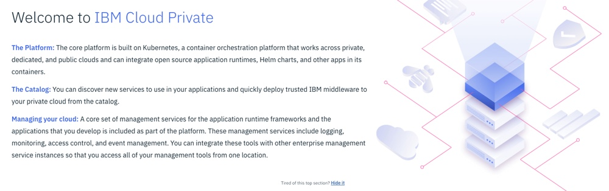

Locate the following information:

1. Which catalog item would you use if you want to **migrate an application that uses WebSphere Application Server**?

2. Which catalog item would you use if you want to **build a 12-factor microservice**?

3. What tool can you use to **chat with the team** if you have any issues?

### Dashboard 
Click **Menu** in the top left corner of the page, and then select **Dashboard** to navigate to the Dashboard page. The Dashboard page provides an overview of the current status of the ICP cluster.
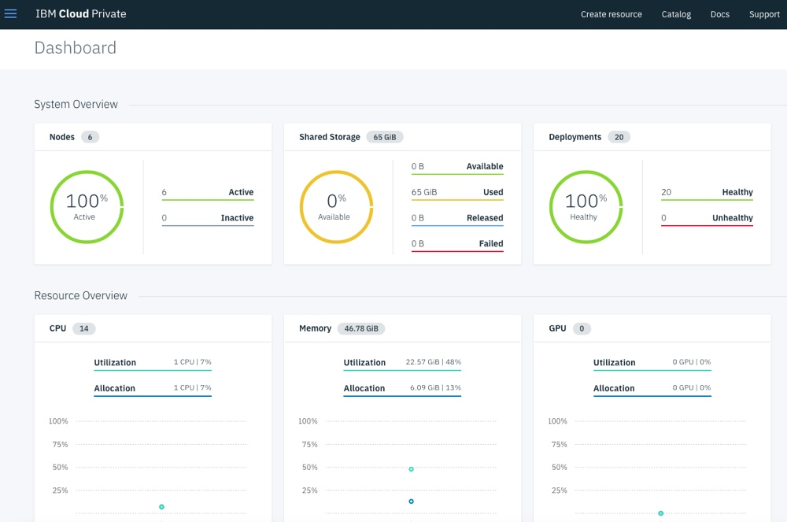

Locate the following information:

1. How many **Nodes** are in your ICP Cluster?

2. How much **Storage** is currently available in your ICP Cluster?

3. Are all of the **Deployments** in your ICP Cluster healthy?

### Nodes 
Click **Menu**, and then select **Platform > Nodes** to navigate to the Nodes page. This page displays information about the nodes that are part of the ICP Cluster.
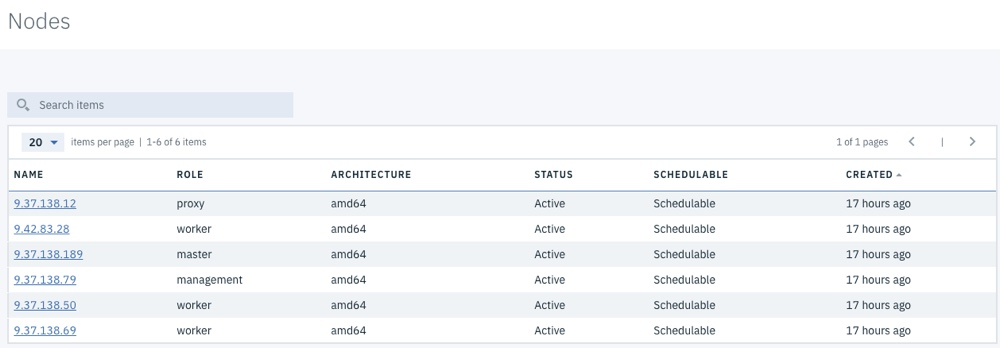

Note: Click the **command prompt** icon in the bottom right corner of the screen to see the command that a user can issue from the **Kubernetes CLI command prompt** to see the same information that displays in the Administration Console.

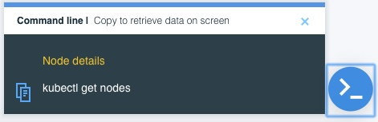

Click the **Name** of the node to *drill down* and see more information about the node.
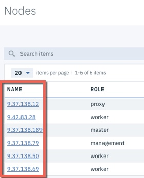

Locate the following information:

1. How many **Worker nodes** are in your cluster?

2. What is the **Architecture** of your master node?

3. How much **memory** does your proxy node have?

4. How many **CPUs** do each of your worker nodes have?

5. Which node is the **logging-elk-data-0** pod deployed to?

### Namespaces 
Click **Menu** and then select **Manage > Namespaces** to navigate to the Namespaces page.

Users are assigned to organizational units called namespaces.
Namespaces are also known as tenants or accounts. In IBM Cloud Private, users are assigned to teams. You can assign multiple namespaces to a team. Users of a team are members of the team's namespaces.
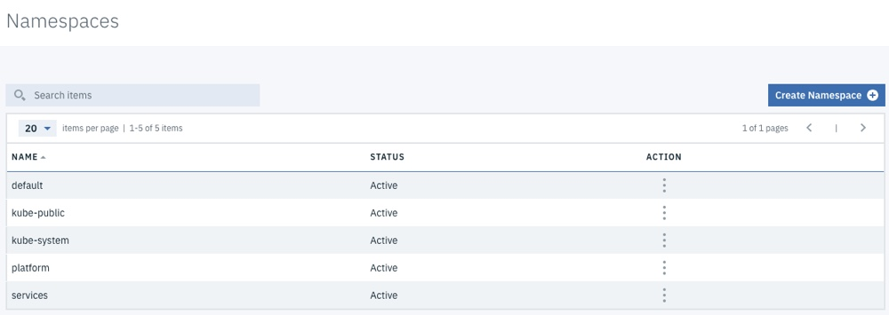

Locate the following information:

1. How many **namespaces** were automatically created in your cluster during installation?

2. What **actions** can you take on namespaces?

### Helm Charts 
Click **Catalog** on the navigation bar to navigate to the Helm Chart Catalog page.

By using the Catalog, you can browse and install packages in your IBM Cloud Private cluster from Helm charts.

The Catalog displays Helm charts, which contain application packages that can run as Kubernetes services. The packages are stored in repositories. The Catalog in IBM Cloud Private contains connections to recommended repositories by default, but you can connect to other repositories. After you connect to a repository, you can access its charts from the Catalog. Application developers can also develop applications and publish them in the Catalog so that other users can easily access and install the applications.

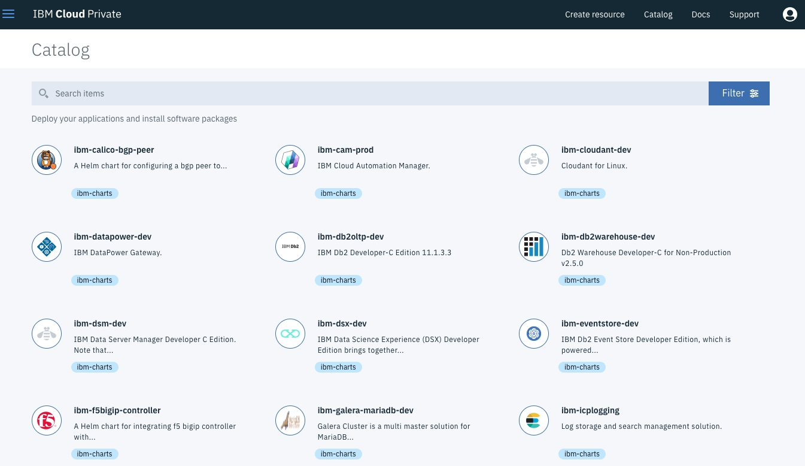

Note: Click on the Helm Chart name to view the readme file.

Locate the following information:

1. What date was the **ibm-jenkins-dev** Helm chart released?

2. How many MQ servers does the **ibm-mqadvanced-server-dev** Helm chart deploy?

3. What type of server does the **ibm-swift-sample** Helm chart deploy the sample application on?

Click **Menu** and then select **Manage > Helm Repositories** to navigate to the list of configured Helm repositories page.

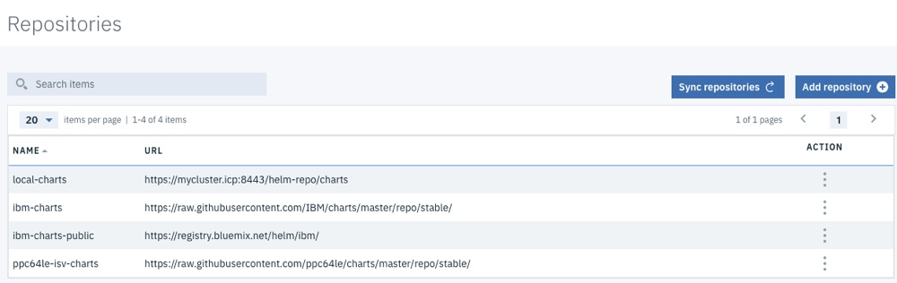

Note: If you want to connect to other repositories, you can add them here.

### Storage 
Click **Menu** and then select **Platform > Storage** to navigate to the Storage page.

Data storage in a Kubernetes cluster is handled by using volumes. For Kubernetes, a PersistentVolume (PV) is a piece of networked storage in a cluster that is provisioned by an administrator. A PersistentVolumeClaim (PVC) is a request for storage that is made by a user.

In an IBM Cloud Private cluster, administrators can create PersistentVolumes that are available to all projects in the cluster. Users can then create PersistentVolumeClaims to request this resource for their application. All PersistentVolume types that are supported by Kubernetes are also supported by IBM Cloud Private.
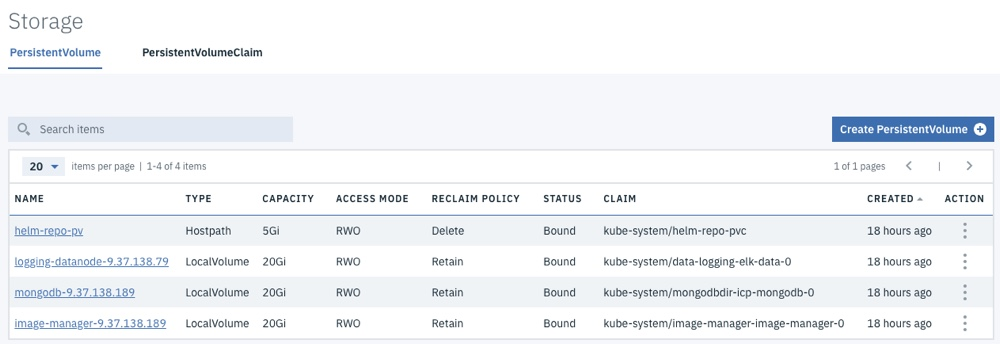

Click **PersistentVolumeClaim** to see the current Persistent Volume Claims in the ICP Cluster
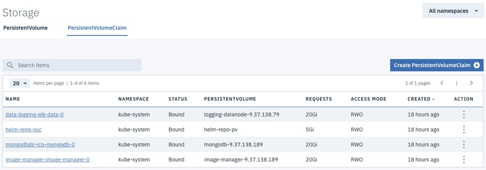

Locate the following information:

1. What is the capacity of the **helm-repo-pv** Persistent Volume?

2. What is the reclaim policy of the **mongodb** Persistent Volume?

3. What namespace is the **helm-repo-pvc** Persistent Volume Claim in?

### Monitoring 
Click **Menu** and then select **Platform > Monitoring** to open Grafana in a new browser window.

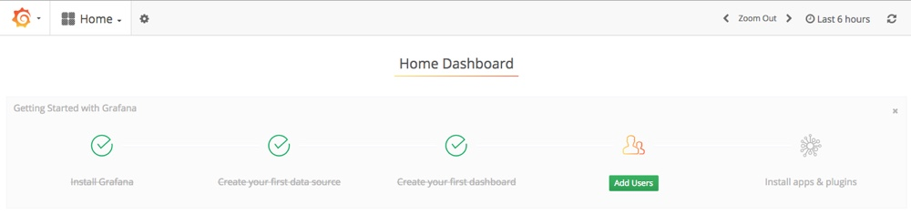

Click **Home** on the navigation bar and select **ICP 2.1 Performance IBM Provided 2.5** from the list to open the IBM provided Grafana page

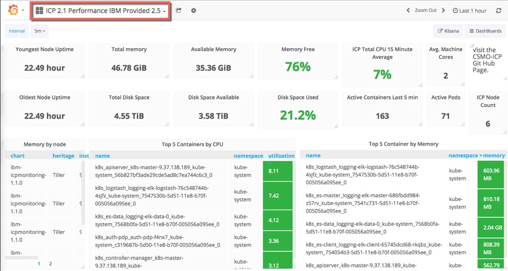

Locate the following information:

1. How many **active pods** are in your ICP cluster?

2. How much **memory** is available in your ICP cluster?

3. Which **pod** is using the most memory currently?

4. Which **pod** is using the most CPU currently?

Close the Grafana browser tab.

### Alerts 
Click **Menu** and then select **Platform > Alerting** to open the ICP Alert Manager in a new browser tab.

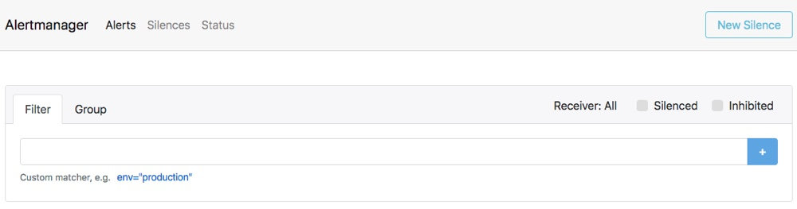

Locate the following information:

1. How many **Alerts** are configured in your ICP cluster?

Close the ICP Alert Manager tab.

### Deployments 
Click **Menu** and then select **Workloads > Deployments** to navigate to the Deployments page. A **Deployment controller** provides declarative updates for **Pods and ReplicaSets**. You describe a desired state in a Deployment object, and the Deployment controller changes the actual state to the desired state at a controlled rate. You can define Deployments to create new ReplicaSets, or to remove existing Deployments and adopt all their resources with new Deployments.

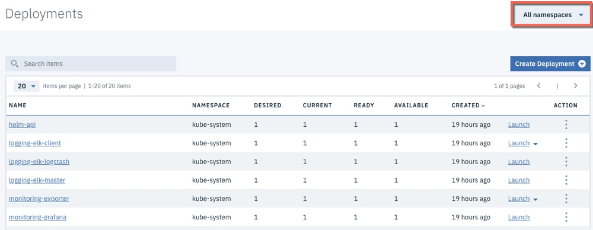

Notes:
1. Click on a Deployment Name to *drill down* and see more information, such as the **Pods** that are part of the Deployment. Scroll down, and click a Pod to find out information about the Container and Logs.

2. Use the **Namespace** drop-down menu in the top right corner of the page to change the Deployments that are displayed.

Locate the following information:

1. How many Deployments are in the **default** Namespace?

2. How many **Pods** are part of the **helm-api** Deployment?

3. Which **Containers** are part of the **helm-api** Deployment?

4. Find the **Logs** for the **es-client** Container in the **logging-elk-client** Deployment.

5. Which **Ports** are exposed on the **es-client** Container in the **logging-elk-client** Deployment?

### StatefulSets 
Click **Menu** and then select **Workloads > StatefulSets** to navigate to the StatefulSets page. Like a Deployment, a StatefulSet manages Pods that are based on an identical container spec. Unlike a Deployment, a StatefulSet maintains a sticky identity for each of their Pods. These pods are created from the same spec, but are not interchangeable: each has a persistent identifier that it maintains across any rescheduling.

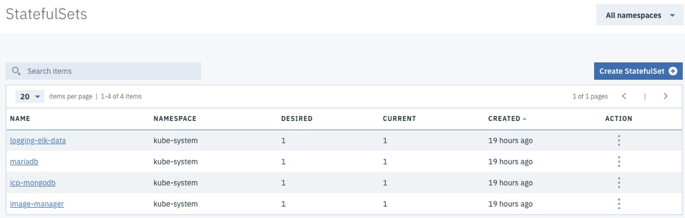

Locate the following information:

1. How many StatefulSets are in the **default** Namespace

2. How many **Pods** are part of the **icp-mongodb** StatefulSet

3. Which **Containers** are part of the **image-manager-0** StatefulSet

4. Find the **Logs** for the **image-manager** Container in the **image-manager-0** StatefulSet

### DaemonSets 
Click **Menu**, and then select **Workloads > DaemonSets** to navigate to the DaemonSets page. A DaemonSet ensures that all (or some) Nodes run a copy of a Pod. As nodes are added to the cluster, Pods are added to the cluster. As nodes are removed from the cluster, those Pods are garbage-collected. Deleting a DaemonSet cleans up the Pods that it created.

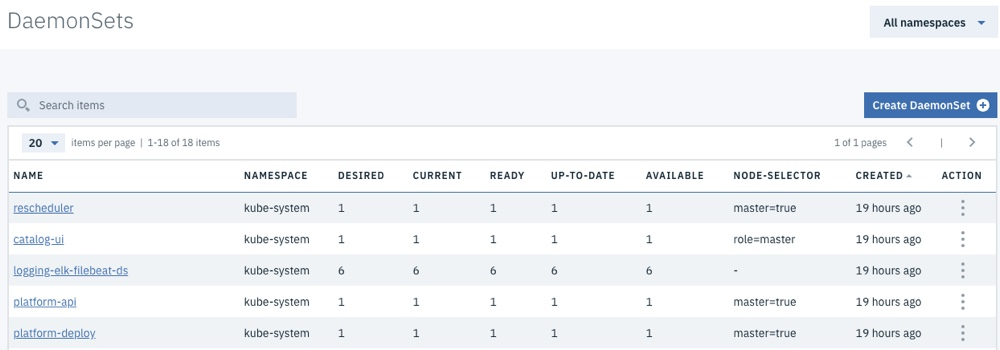

Locate the following information:

1. How many Nodes is the **calico-node** DaemonSet deployed to?

2. How many Nodes is the **rescheduler** DaemonSet deployed to?

3. How does Kubernetes know which Nodes to deploy a DaemonSet to?

### Services 
Click **Menu**, and then select **Network Access > Services** to navigate to the Services page. Kubernetes Pods are mortal;  when they die, they are not resurrected. ReplicaSets in particular create and destroy Pods dynamically (when scaling up or down). While each Pod gets its own IP address, even those IP addresses cannot be relied upon to be stable over time. This leads to a problem: if some set of Pods (for example, call them backends) provides functionality to other Pods (for example,  call them frontends) inside the Kubernetes cluster, how do those frontends find out and keep track of which backends are in that set?

Enter **Services**.

A Kubernetes Service is an abstraction that defines a logical set of Pods and a policy by which to access them - sometimes called a microservice. The set of Pods targeted by a Service is typically determined by a Label Selector.

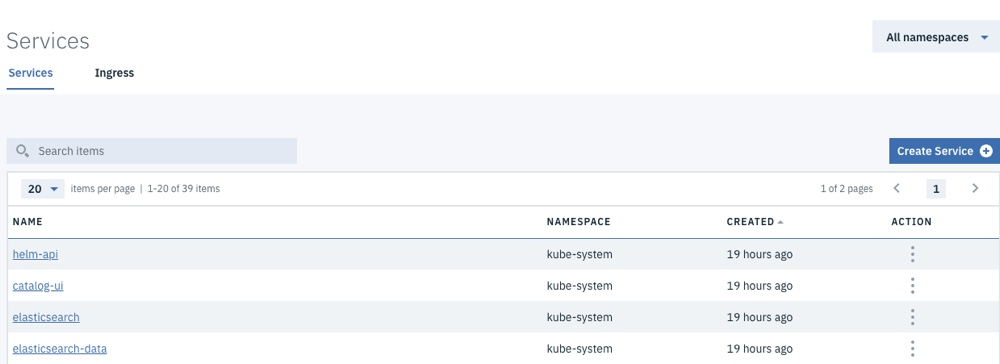

Note: Use the drop-down menu in the upper left corner to customize the number of items displayed per page, or click **>** in the upper right corner to page through a long list of services. Click a service to view more information about it. Click the Action link to view and edit the contents of a service.

Locate the following information:

1. What is the **Label Selector** for the **helm-api** Service?

2. Which **Port** is the **monitoring-prometheus** Service exposing?

3. What is the **targetPort** for the **monitoring-prometheus** Service? (Hint: use the Action link to *drill down* on the Service)

4. In order to access the **monitoring-prometheus** Service, would an application use the **Port** and **targetPort**?

5. Can you access a Service in an ICP Cluster from a browser running outside of the ICP Cluster network?

### Ingress 
Click **Ingress** to navigate to the Ingress page. An Ingress is an API object that manages external access to the services in a cluster, typically HTTP. Ingress can provide load balancing, SSL termination and name-based virtual hosting.

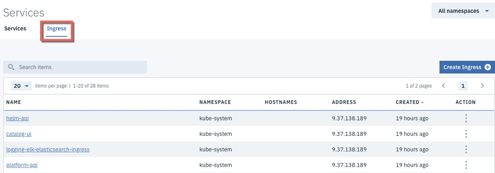

Locate the following information:

1. What **Path** is the **helm-api** Ingress configured to listen on? (Hint: use the Action link to *drill down* on the Ingress)

2. How does the **helm-api** Ingress locate the target **Pod**?

3. Can you access an Ingress in an ICP Cluster from a browser running outside of the ICP Cluster network?

### Command Line Parameters 
Click the **User** icon on the navigation bar and then select **Configure Client** to display the commands that are used to configure a kubectl command line to connect to this ICP Cluster.

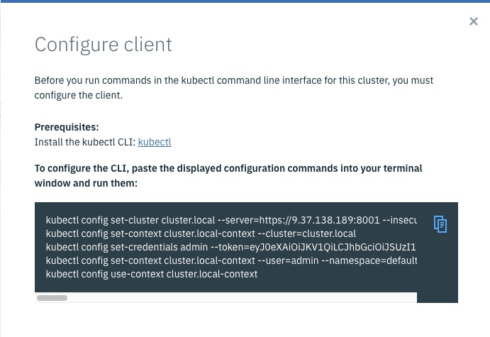

Locate the following information:

1. What should you do with the commands that are displayed here?

Close the **Configure client** dialog box.

#### End of Lab Review
  In this lab exercise, you explored the IBM Cloud Private Administration Console by completing a Treasure Hunt. You learned about:
  - The ICP Admin Console dashboard
  - Nodes, Namespaces, Deployments, StatefulSets, DaemonSets, Services, and Ingress
  - Helm Charts
  - Storage, Monitoring and Alerts

## End of Lab Exercise
