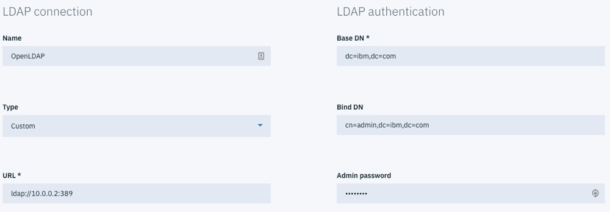
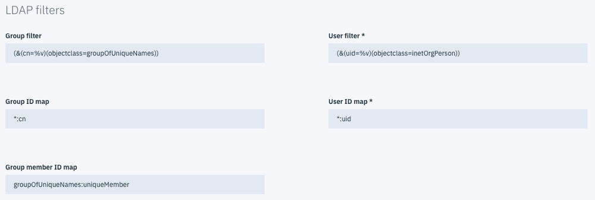
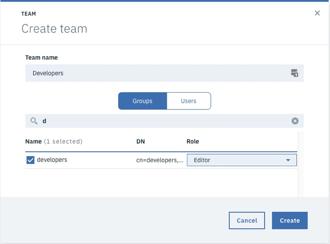
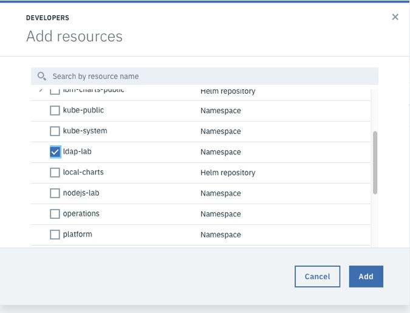
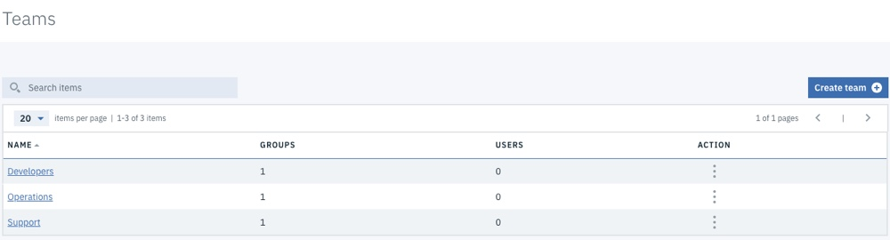
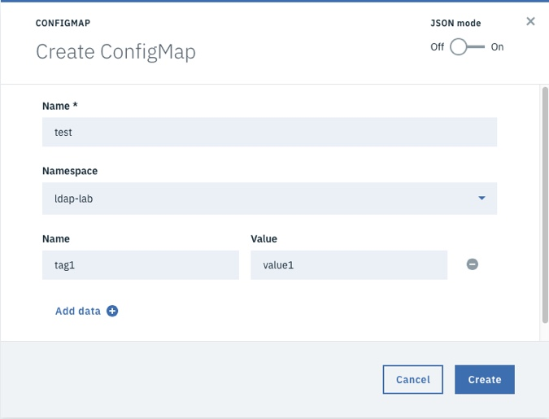

Lab - Configuring IBM Cloud Private to use OpenLDAP
---

### Table of contents
[1. Deploying and Testing OpenLDAP](#deploytest)

[2. Integrate IBM Cloud Private with OpenLDAP](#integrate)

## Overview
In this lab exercise, you deploy a standalone OpenLDAP Docker Container that has been pre-configured with some users and groups to IBM Cloud Private. Later, you configure IBM Cloud Private to use the OpenLDAP instance that you deployed.

<u>When the OpenLDAP server is running, the LDAP schema looks like this:</u>

> **<u>OU=Users</u>**
>
> 		​todd
>
> 		​james
>
> 		​sarah
>
> 		​bob
>
> 		​laura
>
> 		​josie
>
> 		​carlos
>
> 		​jackie
>
> 		​tony
>
> **<u>OU=Groups</u>**
>
> 		​<u>developers</u>
>
> 				​todd
>
> 				​james
>
> 				​sarah
>
> 		​<u>operations</u>
>
> 				​bob
>
> 				​laura
>
> 				​josie
>
> 		​<u>support</u>
>
> 				​carlos
>
> 				​jackie
>
> 				​tony

*Note: The default password for all users is: Passw0rd.*

*Note: This is not intented to be a production LDAP server, it is only being used as an example for integrating ICP with an LDAP server, and testing RBAC concepts.*

> **If you want to build your own OpenLDAP Docker image that is based on this image, you can find the source code here**: https://github.com/jdiggity22/openldap


### Deploying and Testing OpenLDAP <a name="deploytest"></a>
In this section, you create a Kubernetes **Deployment** and a Kubernetes **Service** for the OpenLDAP container. When the container is running, you access the container from a command line, and issue some LDAP queries.

1. If you do not already have one open, open a **terminal** session that is connected to your `boot` node as the **root** user.

2. If not completed in a previous exercise, configure the kubectl command line to connect to your ICP Cluster. Click the **User** icon on the navigation bar in the ICP Admin Console and then select **Configure Client** and copy the commands and paste them in to the terminal window.

3. Copy the following **Deployment** definition in to a file named `openldap-deployment.yaml`:  > The text is available here: https://ibm.box.com/s/z7nprdt9jdx6qesbo1izherachvn7o07

    ```
    apiVersion: apps/v1
    kind: Deployment
    metadata:
      name: ldap
      labels:
        app: ldap
    spec:
      replicas: 1
      selector:
        matchLabels:
          app: ldap
      template:
        metadata:
          labels:
            app: ldap
        spec:
          containers:
            - name: ldap
              image: johnowebb/openldap:latest
              ports:
                - containerPort: 389
                  name: openldap

    ```

4. Copy the following **Service** definition in to a file named **openldap-service.yml**: > The text is available here: https://ibm.box.com/s/mu4e0gh38v2omsp56n1cbh4llv3otz1c

    ```
    apiVersion: v1
    kind: Service
    metadata:
      labels:
        app: ldap
      name: ldap-service
    spec:
      ports:
        - port: 389
      selector:
        app: ldap
    ```

4. Run the following kubectl commands to create the **Deployment** and **Service**:

  `kubectl create -f ./openldap-deployment.yml`

  `kubectl create -f ./openldap-service.yml`

  Example output
  ```
  # kubectl create -f ./openldap-deployment.yml
  deployment.apps "ldap" created
  # kubectl create -f ./openldap-service.yml
  service "ldap-service" created
  ```

5. Verify that the pod is running with the following command:

  `kubectl get po`

  Example output

  ```
  # kubectl get po
  NAME                    READY     STATUS    RESTARTS   AGE
  ldap-64745886dd-ljfdr   1/1       Running   0          2m
  ```

6. Using the **pod name** from the previous command, run the following command to **describe the pod**:

   `kubectl describe po <pod_name>`

   Example output

  ```
  # kubectl describe po ldap-64745886dd-ljfdr
  Name:           ldap-64745886dd-ljfdr
  Namespace:      default
  Node:           pit-icp-worker-02/172.16.3.24
  Start Time:     Thu, 10 May 2018 23:56:31 -0400
  Labels:         app=ldap
                  pod-template-hash=2030144288
  Annotations:    kubernetes.io/psp=default
  Status:         Running
  IP:             10.1.99.197
  Controlled By:  ReplicaSet/ldap-64745886dd
  Containers:
    ldap:
      Container ID:   docker://b82c6ee4983e8c664b07ac06a2773639de30e18e3fc23a356649cb2752d689a5
      Image:          johnowebb/openldap:latest
      Image ID:       docker-pullable://johnowebb/openldap@sha256:1fa63e2849d7a75389beedbdcd660e46029d6a777c9ac22f01693076910164a2
      Port:           389/TCP
      Host Port:      0/TCP
      State:          Running
        Started:      Thu, 10 May 2018 23:56:46 -0400
      Ready:          True
      Restart Count:  0
      Environment:    <none>
      Mounts:
        /var/run/secrets/kubernetes.io/serviceaccount from default-token-2sn5d (ro)
  Conditions:
    Type           Status
    Initialized    True
    Ready          True
    PodScheduled   True
  Volumes:
    default-token-2sn5d:
      Type:        Secret (a volume populated by a Secret)
      SecretName:  default-token-2sn5d
      Optional:    false
  QoS Class:       BestEffort
  Node-Selectors:  <none>
  Tolerations:     node.kubernetes.io/not-ready:NoExecute for 300s
                   node.kubernetes.io/unreachable:NoExecute for 300s
  Events:
    Type    Reason                 Age   From                        Message
    ----    ------                 ----  ----                        -------
    Normal  Scheduled              5m    default-scheduler           Successfully assigned ldap-64745886dd-ljfdr to pit-icp-worker-02
    Normal  SuccessfulMountVolume  5m    kubelet, pit-icp-worker-02  MountVolume.SetUp succeeded for volume "default-token-2sn5d"
    Normal  Pulling                5m    kubelet, pit-icp-worker-02  pulling image "johnowebb/openldap:latest"
    Normal  Pulled                 5m    kubelet, pit-icp-worker-02  Successfully pulled image "johnowebb/openldap:latest"
    Normal  Created                5m    kubelet, pit-icp-worker-02  Created container
    Normal  Started                5m    kubelet, pit-icp-worker-02  Started container
  ```

7. Enter the following command to get the **Cluster IP** that has been assigned to the **Service**. You use this value later in the lab Exercise.

  `kubectl describe service ldap-service`

  Example output (in this case, the **Cluster IP** is **10.0.0.2**):

  ```
  # kubectl describe service ldap-service
  Name:              ldap-service
  Namespace:         default
  Labels:            app=ldap
  Annotations:       <none>
  Selector:          app=ldap
  Type:              ClusterIP
  IP:                10.0.0.2
  Port:              <unset>  389/TCP
  TargetPort:        389/TCP
  Endpoints:         10.1.116.198:389
  Session Affinity:  None
  Events:            <none>
  ```


8. Connect to the pod with an interactive shell by using the following command:

   `kubectl exec <pod_name> -it bash`

   Example output (note that you are now inside the container as the root user):

   ```
   # kubectl exec ldap-6b4898575b-q9qrw -it bash
   root@ldap-6b4898575b-q9qrw:/#

   ```

9. To verify that the LDAP server is responding, and that the LDAP user and groups are available, run the following command to perform an **ldapsearch**:

  `ldapsearch -x -h localhost -b dc=ibm,dc=com -D "cn=admin,dc=ibm,dc=com" -w Passw0rd`

	Example output

  ```
  # extended LDIF
  #
  # LDAPv3
  # base <dc=ibm,dc=com> with scope subtree
  # filter: (objectclass=*)
  # requesting: ALL
  #

  # ibm.com
  dn: dc=ibm,dc=com
  objectClass: top
  objectClass: dcObject
  objectClass: organization
  o: IBM
  dc: ibm

  # admin, ibm.com
  dn: cn=admin,dc=ibm,dc=com
  objectClass: simpleSecurityObject
  objectClass: organizationalRole
  cn: admin
  description: LDAP administrator
  userPassword:: e1NTSEF9bitWdGJvZ2RIcXhNbTVDM0tZNTZrY1ByTHcxWHJQM0U=

  # users, ibm.com
  dn: ou=users,dc=ibm,dc=com
  objectClass: organizationalUnit
  description: All users in organization
  ou: users

  # groups, ibm.com
  dn: ou=groups,dc=ibm,dc=com
  objectClass: organizationalUnit
  objectClass: top
  ou: groups

  # todd, users, ibm.com
  dn: uid=todd,ou=users,dc=ibm,dc=com
  objectClass: inetOrgPerson
  objectClass: organizationalPerson
  objectClass: person
  objectClass: top
  cn: toddCN
  sn: toddSN
  uid: todd
  userPassword:: UGFzc3cwcmQ=

  # james, users, ibm.com
  dn: uid=james,ou=users,dc=ibm,dc=com
  objectClass: inetOrgPerson
  objectClass: organizationalPerson
  objectClass: person
  objectClass: top
  cn: jamesCN
  sn: jamesSN
  uid: james
  userPassword:: UGFzc3cwcmQ=

  # sarah, users, ibm.com
  dn: uid=sarah,ou=users,dc=ibm,dc=com
  objectClass: inetOrgPerson
  objectClass: organizationalPerson
  objectClass: person
  objectClass: top
  cn: sarahCN
  sn: sarahSN
  uid: sarah
  userPassword:: UGFzc3cwcmQ=

  # bob, users, ibm.com
  dn: uid=bob,ou=users,dc=ibm,dc=com
  objectClass: inetOrgPerson
  objectClass: organizationalPerson
  objectClass: person
  objectClass: top
  cn: bobCN
  sn: bobSN
  uid: bob
  userPassword:: UGFzc3cwcmQ=

  # laura, users, ibm.com
  dn: uid=laura,ou=users,dc=ibm,dc=com
  objectClass: inetOrgPerson
  objectClass: organizationalPerson
  objectClass: person
  objectClass: top
  cn: lauraCN
  sn: lauraSN
  uid: laura
  userPassword:: UGFzc3cwcmQ=

  # josie, users, ibm.com
  dn: uid=josie,ou=users,dc=ibm,dc=com
  objectClass: inetOrgPerson
  objectClass: organizationalPerson
  objectClass: person
  objectClass: top
  cn: josieCN
  sn: josieSN
  uid: josie
  userPassword:: UGFzc3cwcmQ=

  # carlos, users, ibm.com
  dn: uid=carlos,ou=users,dc=ibm,dc=com
  objectClass: inetOrgPerson
  objectClass: organizationalPerson
  objectClass: person
  objectClass: top
  cn: carlosCN
  sn: carlosSN
  uid: carlos
  userPassword:: UGFzc3cwcmQ=

  # jackie, users, ibm.com
  dn: uid=jackie,ou=users,dc=ibm,dc=com
  objectClass: inetOrgPerson
  objectClass: organizationalPerson
  objectClass: person
  objectClass: top
  cn: jackieCN
  sn: jackieSN
  uid: jackie
  userPassword:: UGFzc3cwcmQ=

  # tony, users, ibm.com
  dn: uid=tony,ou=users,dc=ibm,dc=com
  objectClass: inetOrgPerson
  objectClass: organizationalPerson
  objectClass: person
  objectClass: top
  cn: tonyCN
  sn: tonySN
  uid: tony
  userPassword:: UGFzc3cwcmQ=

  # developers, groups, ibm.com
  dn: cn=developers,ou=groups,dc=ibm,dc=com
  objectClass: groupOfUniqueNames
  objectClass: top
  cn: developers
  uniqueMember: uid=todd,ou=users,dc=ibm,dc=com
  uniqueMember: uid=james,ou=users,dc=ibm,dc=com
  uniqueMember: uid=sarah,ou=users,dc=ibm,dc=com

  # operations, groups, ibm.com
  dn: cn=operations,ou=groups,dc=ibm,dc=com
  objectClass: groupOfUniqueNames
  objectClass: top
  cn: operations
  uniqueMember: uid=bob,ou=users,dc=ibm,dc=com
  uniqueMember: uid=laura,ou=users,dc=ibm,dc=com
  uniqueMember: uid=josie,ou=users,dc=ibm,dc=com

  # support, groups, ibm.com
  dn: cn=support,ou=groups,dc=ibm,dc=com
  objectClass: groupOfUniqueNames
  objectClass: top
  cn: support
  uniqueMember: uid=carlos,ou=users,dc=ibm,dc=com
  uniqueMember: uid=jackie,ou=users,dc=ibm,dc=com
  uniqueMember: uid=tony,ou=users,dc=ibm,dc=com

  # readonly, ibm.com
  dn: cn=readonly,dc=ibm,dc=com
  cn: readonly
  objectClass: simpleSecurityObject
  objectClass: organizationalRole
  userPassword:: e1NTSEF9aWQybWxLSXB2dzlPcGVUUlkzRVBBQk1VWG1nd00rUnU=
  description: LDAP read only user

  # search result
  search: 2
  result: 0 Success

  # numResponses: 18
  # numEntries: 17
  ```

8. Type `exit` to close your interactive session.


### Integrate IBM Cloud Private with OpenLDAP <a name="integrate"></a>
In this section, you configure IBM Cloud Private to use the OpenLDAP server that you just deployed for Role Based Access Control (RBAC).

#### Create the LDAP Connection
1. If you are not already logged in to the ICP Admin Console from a previous exercise, open a browser and navigate to `https://10.0.0.2:8443`. Log in by using `username: admin` and `password: admin`.

2. Click **Menu**, and then select **Manage > Authentication**.

3. When the **No LDAP connection found** message displays, click **Create LDAP Connection**.

4. Enter the following details:

   #### LDAP Connection

   - Name: `OpenLDAP`

   - Type: `Custom`

   - URL: `ldap://ip-of-ldap-service:389`  

     **Note:** You collected the ip-of-ldap-service earlier when you issued the  *kubectl describe service ldap-service* command.

   #### LDAP authentication

   - Base DN: `dc=ibm,dc=com`
   - Bind DN: `cn=admin,dc=ibm,dc=com`
   - Admin Password: `Passw0rd`

   

   #### LDAP Filters

   - Group filter: `(&(cn=%v)(objectclass=groupOfUniqueNames))`
   - User filter: `(&(uid=%v)(objectclass=inetOrgPerson))`
   - Group ID map: `*:cn`
   - User ID map: `*:uid`
   - Group member ID map: `groupOfUniqueNames:uniqueMember`

   

5. Click **Test Connection** to make sure your settings are valid. If so, you see a message stating that your connection is valid.

6. Click **Connect** to create the connection.

#### Create Namespaces
To prevent different groups from being able to view or modify each other's resources, you can create a level of isolation. To do this, create namespaces that you can associate with your teams.

1. Execute the following command to create an ICP namespace:

   ```
   kubectl create namespace ldap-lab
   ```

#### Create Teams
In the section, you work through the process of creating teams in ICP, and assign roles to them. These teams are based on the LDAP groups that are defined in your OpenLDAP container.

1. In the ICP Admin Console click **Manage -> Teams**.

2. Click **Create team**.

3. Enter the team name *developers*.

4. Select the developers group from the table below.

   **Note:** The LDAP groups do not show up in the table below until a filter is applied. To find the developers' group, type "d" in the search field. The groups that start with "d" are populated in the table.

5. Grant the developer team ***Editor*** access.

  

6. Click **Create**.

7. Select the team that you created from the *Teams* list.

8. Navigate to the *Resources* tab.

9. Click **Add resources**.

10. From the list of namespaces, select *ldap-lab*.

  

11. Click **Add**.

  Repeat the process to create two more teams with the values below.

  | Team Name  | LDAP Group | Role     | Namespace  |
  | ---------- | ---------- | -------- | ---------- |
  | operations | operations | operator | ldap-lab |
  | support    | support    | viewer   | ldap-lab    |

  When you are finished, you have three **Teams**.

    

#### Validate the Users
In this section, you explore the differences between the groups that you created. Follow the steps below to explore the differences between the roles assigned to the different groups.

1. Log out of the ICP Administration Console.

2. Log in as a member of the **developers** team that has **editor** rights, for example, `todd` with password: `Passw0rd`.

3. Check whether you can see any existing **Deployments**, **ConfigMaps** or other artifacts.  Note that the `ldap-lab` namespace is empty, and `todd` can not see artifacts in other namespaces. Also, `todd` can not create anything.

4. Log out of the ICP Administration Console.

5. Log in as a member of the **support** team that has **viewer** rights, for example, `carlos` with password: `Passw0rd`.

6. Check whether you can see any existing **Deployments**, **ConfigMaps** or other artifacts. Note that the `ldap-lab` namespace is empty, and `carlos` can not see artifacts in other namespaces. Also, `carlos` can not create anything.

7. Log out of the ICP Administration Console.

8. Log in as a member of the **operations** team that has **operator** rights, for example, `bob` with password: `Passw0rd`.

9. Check whether you can see any existing **Deployments**, **ConfigMaps** or other artifacts. Note that the `ldap-lab` namespace is empty, and `bob` can not see artifacts in other namespaces. Also note that `bob` has access to create Deployemnts and ConfigMaps.

10. Create a simple **ConfigMap** with one name/value pair, such as the one below.

  

11. Log out of the ICP Administration Console.

12. Log in as a member of the **developers** team that has **editor** rights, for example, `todd` with password: `Passw0rd`.

13. Can you see the **ConfigMap**? Can you change it?

14. Log out of the ICP Administration Console.

15. Log in as a member of the **support** team that has **viewer** rights, for example, `carlos` with password: `Passw0rd`.

13. Can you see the **ConfigMap**? Can you change it?

14. Log out of the ICP Administration Console.

#### End of Lab Review
  In this lab exercise, you explored Role Based Access Control in IBM Cloud Private. You learned about:
  - Deploying OpenLDAP in a container for testing purposes.
  - Configuring IBM Cloud Private to connect to LDAP
  - Creating Teams and assigning Resources
  - The different types of access control that are available in IBM Cloud Private

## End of Lab Exercise
