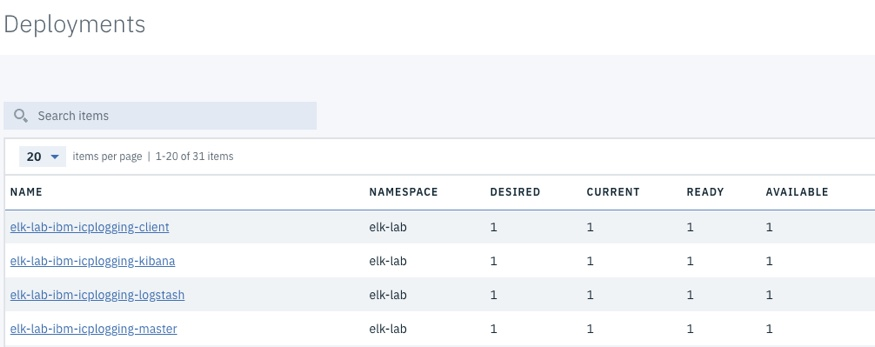
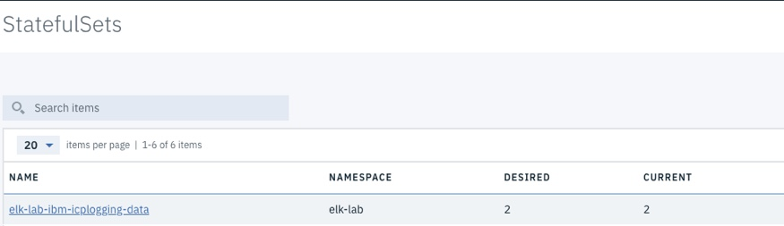
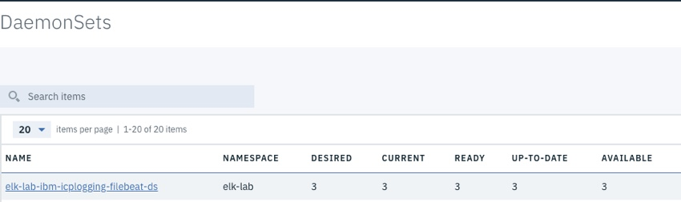
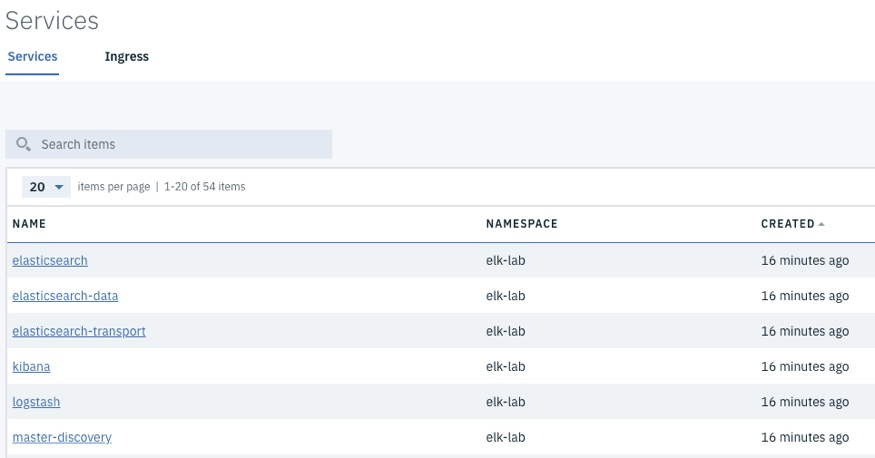
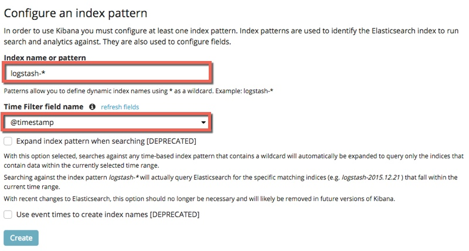

Lab - Restricting ELK Logging
---

### Table of contents
[1. Installing a dedicated ELK stack](#install)

[2. Modifying filebeat to only send certain logs](#filebeat)

## Overview
Many organizations use a single ICP Cluster to host multiple *tenants*. These tenants are granted access to a given set of namespaces and resources, and should not be able to see, or administer other namespaces that are owned by other tenants. Configuration is required to restrict the logs that are collected and analyzed by ELK to the correct namespaces. In this lab exercise, you install ELK in a namespace, and then configure it to only collect certain logs.

### Installing a dedicated ELK stack <a name="install"></a>
In this section, you create a new namespace and install ELK by using the IBM provided Helm Chart.

#### Create Persistent Volumes (PV)
ELK requires two PVCs to function. The following steps walk you through the process of creating the PVs.

**Note**: In this lab environment, the NFS Server is running on the icp-proxy node. In a *production* environment, a dedicated NFS Server probably exists.

1. In a **terminal** session that is connected to your `boot` node as the **root** user, run the following commands to create the directories that are mapped to the PV:

    ```
    cd /storage

    mkdir elk-storage1

    mkdir elk-storage2

    chmod 777 elk*
    ```

2. In a **terminal** session that is connected to your `boot` node as the **root** user, copy the following PV definition in to a file named `elk-pv1.yaml`, and change the **server IP address** (10.0.0.1) to the correct one for your environment.

    ```
    apiVersion: v1
    kind: PersistentVolume
    metadata:
      name: elk-storage1
    spec:
      accessModes:
        - ReadWriteOnce
      persistentVolumeReclaimPolicy: Recycle
      capacity:
        storage: 10Gi
      nfs:
        path: /storage/elk-storage1
        server: 10.0.0.1
    ```

3. Copy the following PV definition in to a file named `elk-pv2.yaml`, and change the **server IP address** (10.0.0.1) to the correct one for your environment:

    ```
    apiVersion: v1
    kind: PersistentVolume
    metadata:
      name: elk-storage2
    spec:
      accessModes:
        - ReadWriteOnce
      persistentVolumeReclaimPolicy: Recycle
      capacity:
        storage: 10Gi
      nfs:
        path: /storage/elk-storage2
        server: 10.0.0.1
    ```
4. Configure the kubectl command line to connect to your ICP Cluster. Click the User icon on the navigation bar in the ICP Admin Console, and then select Configure Client. Copy the commands and paste them in to the terminal window.

5. Create the Persistent Volumes by using the following commands:

    ```
    kubectl create -f ./elk-pv1.yaml

    kubectl create -f ./elk-pv2.yaml
    ```

#### Create a new namespace for ELK
In this section you will create a new namespace for the standalone ELK stack

1. Create the **elk-lab** namespace using the following command:

    ```
    kubectl create namespace elk-lab
    ```

#### Configure the namespace for privileged containers
The ELK containers require the IPC_LOCK privilege, which must be added to the new namespaces.

1. Run the following command to open a vi session to change the security policy

  ```
  kubectl edit clusterrolebindings privileged-psp-users
  ```

2. Scroll to the end of the file and insert the following content starting on a new line

  ```
  - apiGroup: rbac.authorization.k8s.io
    kind: Group
    name: system:serviceaccounts:elk-lab
  ```

  **Note:** Ensure the line spacing is exactly as shown below:

  ```
  - apiGroup: rbac.authorization.k8s.io
    kind: Group
    name: system:serviceaccounts:federation-system
  - apiGroup: rbac.authorization.k8s.io
    kind: Group
    name: system:serviceaccounts:elk-lab
  ```

3. Save your changes and quit the vi session.

#### Deploy the ELK Helm Chart
In this section you deploy an instance of ELK in to the **elk-lab** namespace.

1. Click **Catalog** from the ICP Admin Console menu bar to navigate to the Catalog of Helm Charts, and search for the `ibm-icplogging` chart.

2. Click the chart, read the overview, and then click **Configure**.

3. Enter the following information (accept the defaults for all other values), and click **Install**:

  | Parameter       | Value |
  | ------------- |-------------|
  | Release name  | elk-lab |
  | Target namespace  | elk-lab |
  | I have read and agreed to the License Agreements | yes |

4. The ELK components will take a few minutes to start up. You should eventually see the following:

    **Four Deployments - all available**

    

    **A StatefulSet with 2 current instances**

    

    **A DaemonSet with 3 available instances**

    

    **Six Services**

    

#### Access Kibana
Now that ELK is running, access Kibana and verify that you can see data from all namespaces in the ICP Cluster.

1. Click **Menu**, and then select **Network Access --> Services**.

2. Click the **kibana** service in the **elk-lab** namespace.

3. Click the **NodePort** link to open Kibana.

4. Configure an **Index Pattern** by using **Index name or pattern**: `logstash-*`, and **Time Filter field name**: `@timestamp`.

  

5. Click **Discover** on the left-hand menu to run a default query against ElasticSearch for all log messages that have been generated in the last 15 minutes.

6. Modify the fields that are shown on the screen. Click the **Settings icon** on the **Available Fields** line, and add the following fields: ``` kubernetes.namespace```, and ```log```.

**Note:** the namespaces that are displayed include kube-system, which proves that this ELK instance is collecting data from other namespaces.

### Modifying filebeat to only send certain logs <a name="filebeat"></a>
The **filebeat** component is responsible for collecting log messages from containers and forwarding them to Logstash. The version of filebeat in ICP 2.1.0.3 is 5.5.1 which has no **kubernetes** extensions. As a result, the log messages that are forwarded have the following format, which has no concept of namespaces or containers:

  ```
  "@timestamp": "2018-06-01T16:34:56.387Z",
   "beat": {
     "hostname": "elk-ibm-icplogging-filebeat-ds-bp8g4",
     "name": "elk-ibm-icplogging-filebeat-ds-bp8g4",
     "version": "5.5.1"
   },
   "input_type": "log",
   "log": "2018-05-31 14:58:02.371 [INFO][72] table.go 438: Loading current iptables state and checking it is correct. ipVersion=0x4 table=\"nat\"",
   "node": {
     "hostname": "9.37.138.50"
   },
   "offset": 14247592,
   "pod": {
     "ip": "10.1.116.221"
   },
   "source": "/var/log/containers/calico-node-w8l8l_kube-system_calico-node-7e588613060d064587557aa204ffaddace743a405ea1dac20f6fcf6a03d016e0.log",
   "stream": "stdout",
   "tags": [
     "k8s-app"
   ],
   "time": "2018-05-31T14:58:02.371698215Z",
   "type": "kube-logs"
  }
  ```

**Logstash** parses the log messages by using the following rules: `"source" => "/var/log/containers/%{kubernetes.pod}_%{kubernetes.namespace}_%{container_file_ext}  `

  For example: `"source": "/var/log/containers/calico-node-w8l8l_kube-system_calico-node-7e588613060d064587557aa204ffaddace743a405ea1dac20f6fcf6a03d016e0.log",
  ` is parsed in to **kubernetes.pod** = calico-node-w8l8l and **kubernetes.namespace** = kube-system

In this section, you modify the filebeat configuration to only send log messages for a given set of namespaces.

1. Run the following command to open a vi session to change the filebeat configuration

  ```
  kubectl edit cm elk-lab-ibm-icplogging-filebeat-ds-config --namespace elk-lab
  ```

2. Scroll down to the `logging.level: info` line and change the value to **debug** as shown below:

  ```
  output.logstash:
  hosts: logstash:5000
  timeout: 15
  logging.level: debug
  ```

3. Insert the following lines after the `logging.level` line to allow only messages from elk-lab and nodejs-lab through. **NOTE:** the **spacing** before each line must be exactly as shown below. Do NOT use *tab*, only use *space*

```
  logging.level: debug
  processors:
  - drop_event.when.not.or:
      - contains.source: "_elk-lab_"
      - contains.source: "_nodejs-lab_"
```

4. Save your changes and quit the vi session

5. Run the following command to trigger the filebeat pods to restart with the new configuration:

  `kubectl get pods --namespace elk-lab |grep filebeat|awk '{print $1}' | xargs -i sh -c 'kubectl delete pod -o name {} --namespace elk-lab && sleep 4'
`

6. Wait a few minutes for filebeat to restart and the logs to start processing.

7. Return to Kibana and refresh the **Discover** page. Note that the most recent logs are from `elk-lab` and not `kube-system`.

8. Search for logs from `kube-system` by using ```kubernetes.namespace: kube-system```, and verify that they are not recent. Changing the filebeat parameters does not delete old logs that were already collected.

9. In the ICP Admin Console navigate to the `elk-lab-ibm-icplogging-filebeat-ds` **DaemonSet** and look at the logs. You see **DBG  Publish** and **DBG  Drop Event** messages like the ones below that show the message that filebeat sends to ElasticSearch, and the messages that are dropped:

```
2018/06/01 18:57:41.613174 client.go:214: DBG  Publish: {
  "@timestamp": "2018-06-01T18:57:26.217Z",
  "beat": {
    "hostname": "elk-ibm-icplogging-filebeat-ds-89xfp",
    "name": "elk-ibm-icplogging-filebeat-ds-89xfp",
    "version": "5.5.1"
  },
  "input_type": "log",
  "log": "}",
  "node": {
    "hostname": "9.37.138.50"
  },
  "offset": 12807330,
  "pod": {
    "ip": "10.1.116.239"
  },
  "source": "/var/log/containers/elk-ibm-icplogging-filebeat-ds-89xfp_elk-lab_filebeat-773d3f7aff80dcb0c7a213c41adaa3354e28c90f738fb0d66540bc17d7d79f48.log",
  "stream": "stderr",
  "tags": [
    "k8s-app"
  ],
  "time": "2018-06-01T18:45:35.773371427Z",
  "type": "kube-logs"
2018/06/01 18:57:41.613055 client.go:210: DBG  Drop event {
  "@timestamp": "2018-06-01T18:57:26.216Z",
  "beat": {
    "hostname": "elk-ibm-icplogging-filebeat-ds-89xfp",
    "name": "elk-ibm-icplogging-filebeat-ds-89xfp",
    "version": "5.5.1"
  },
  "input_type": "log",
  "log": "2018-06-01 00:08:38.524 [INFO][72] ipsets.go 222: Asked to resync with the dataplane on next update. family=\"inet\"",
  "node": {
    "hostname": "9.37.138.50"
  },
  "offset": 20150598,
  "pod": {
    "ip": "10.1.116.239"
  },
  "source": "/var/log/containers/calico-node-w8l8l_kube-system_calico-node-7e588613060d064587557aa204ffaddace743a405ea1dac20f6fcf6a03d016e0.log",
  "stream": "stdout",
  "tags": [
    "k8s-app"
  ],
  "time": "2018-06-01T00:08:38.524562186Z",
  "type": "kube-logs"
}
}
}
```

#### Delete the ELK Helm Chart
In this section you delete the ELK deployment due to disk space restrictions on the boot node.

1. Run the following command to delete the Helm Release

    ```
    helm delete --purge elk-lab --tls
    ```

#### End of Lab Review
In this lab exercise, you configured *restricted* logging in IBM Cloud Private. You:
- Installed a dedicated ELK stack in a namespace
- Configured filebeat to only send log messages from a given set of a namespaces
- Validated the configuration

## End of Lab Exercise
